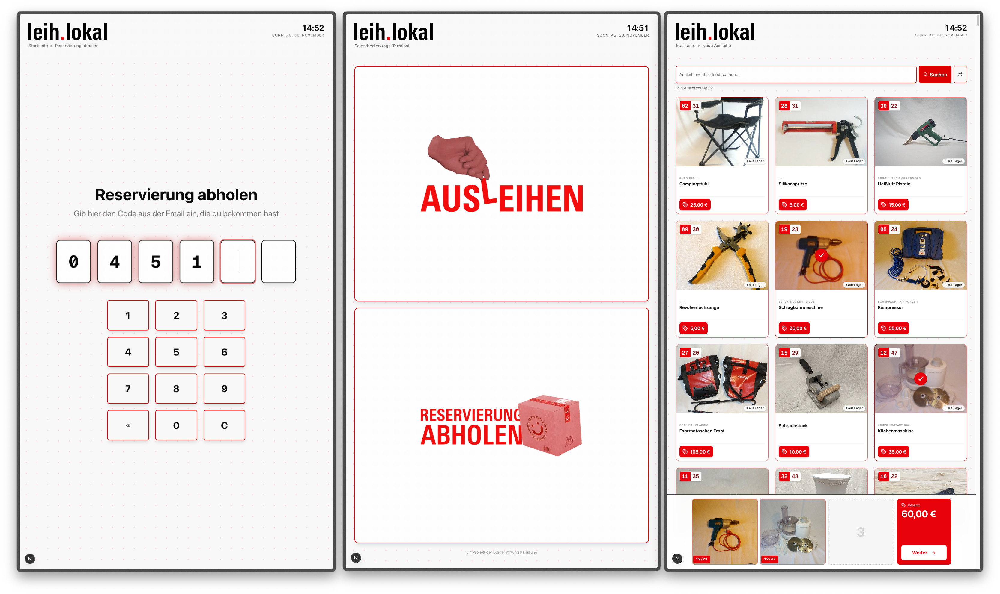

# leih.lokal Self Service (LLKA-S)

Modern self-service terminal for a library of things built with Next.js, React and PocketBase.



## Tech Stack

- **Frontend**: Next.js 15 (App Router), React 19, TypeScript
- **UI**: Shadcn/ui + Tailwind CSS
- **Animations**: Framer Motion
- **Backend**: PocketBase
- **PWA**: next-pwa

## Features

### 🛍️ New Rental Flow
- Browse available items with search and shuffle functionality
- Select up to 3 items for rental
- Customer identification (existing or new customer)
- Automated rental creation with deposit calculation
- Receipt display with return date

### 📦 Pickup Reservation Flow
- OTP-based reservation verification (6-digit code from email)
- Large, accessible OTP input with on-screen keypad
- Reservation details display (customer info, items, deposit)
- One-tap confirmation to mark reservation as picked up
- Deposit reminder screen

### 👤 New Customer Registration
- Simple form for new customer signup
- Newsletter opt-in
- Integrated with rental flow

## Project Structure

```
llka-selfservice/
├── app/                          # Next.js app directory
│   ├── page.tsx                  # Home page (main menu)
│   ├── new-rental/              # New rental flow
│   │   ├── page.tsx             # Item selection
│   │   ├── customer/page.tsx    # Customer identification
│   │   └── success/page.tsx     # Rental receipt
│   ├── pickup-reservation/      # Reservation pickup flow
│   │   └── page.tsx             # OTP entry and confirmation
│   ├── new-customer/            # New customer registration
│   │   └── page.tsx             # Registration form
│   ├── layout.tsx               # Root layout
│   └── globals.css              # Global styles + animations
├── components/                   # React components
│   ├── ui/                      # Base UI components
│   │   ├── animated-dot-grid.tsx # Background animation
│   │   ├── card.tsx             # Card component
│   │   ├── button.tsx           # Button component
│   │   └── ...                  # Other UI components
│   ├── otp-input.tsx            # OTP input with on-screen keypad
│   ├── item-card.tsx            # Item display card
│   ├── selection-bar.tsx        # Selected items bar
│   ├── header.tsx               # App header
│   └── ...                      # Other components
├── lib/                         # Utilities and helpers
│   ├── pocketbase/              # PocketBase integration
│   │   ├── client.ts            # PocketBase client
│   │   ├── collections.ts       # Collection helpers
│   │   ├── queries.ts           # Common queries
│   │   └── auth.ts              # Authentication
│   ├── utils/                   # Utility functions
│   │   ├── formatting.ts        # Date/currency formatting
│   │   └── get-item-image-url.ts # Image URL helper
│   └── constants/               # App constants
│       ├── ui-labels.ts         # UI text labels
│       └── categories.ts        # Item categories
├── types/                       # TypeScript type definitions
│   └── index.ts                 # Shared types
└── public/                      # Static assets
    ├── ausleihen.png            # "New Rental" button image
    ├── abholen.png              # "Pickup" button image
    └── leihlokal.svg            # Logo
```

## Environment Setup

Create a `.env.local` file in the root directory:

```env
NEXT_PUBLIC_POCKETBASE_URL=your_pocketbase_url
NEXT_PUBLIC_TERMINAL_NAME=Terminal_Name
```

## Installation

```bash
# Install dependencies
npm install

# Run development server
npm run dev

# Build for production
npm run build

# Start production server
npm start
```

The app will be available at `http://localhost:3000`

## PocketBase Collections

### Required Collections

#### `customer`
Customer records with fields:
- `iid` (number) - Customer ID
- `firstname`, `lastname` (text)
- `email`, `phone` (text, optional)
- `street`, `postal_code`, `city` (text, optional)
- `registered_on` (date)
- `newsletter` (boolean)

#### `item`
Inventory items with fields:
- `iid` (number) - Item ID
- `name` (text)
- `category` (select, multiple)
- `deposit` (number)
- `copies` (number) - Available copies
- `status` (select) - instock, outofstock, reserved, etc.
- `images` (file, multiple)
- `description`, `brand`, `model` (text, optional)

#### `rental`
Active and completed rentals with fields:
- `customer` (relation to customer)
- `items` (relation to item, multiple)
- `requested_copies` (json) - Copy counts per item
- `deposit`, `deposit_back` (number)
- `rented_on`, `returned_on`, `expected_on` (date)
- `employee` (text)

#### `reservation`
Pickup reservations with fields:
- `customer_iid` (text, optional)
- `customer_name`, `customer_phone`, `customer_email` (text)
- `is_new_customer` (boolean)
- `items` (relation to item, multiple)
- `pickup` (date)
- `otp` (text) - 6-digit pickup code
- `on_premises` (boolean) - Set when customer arrives
- `done` (boolean) - Marks reservation as completed

## Design Features

### Accessibility
- Large touch targets (minimum 56px)
- High contrast colors
- Clear visual hierarchy
- Touch-optimized interactions
- Monospace digits for OTP input

### Animations
- Playful, cinema-style OTP entry with bounce effects
- Smooth page transitions with Framer Motion
- Satisfying micro-interactions on button press
- Animated dot grid background

### Terminal/Kiosk Mode
- Portrait-optimized layouts
- Auto-redirect timers on success screens
- No scrolling on main screens
- Touch-first design with large buttons
- Full-screen OTP entry without card backgrounds

## Hardware

This app is designed to run in portrait mode on a large touch screen display and is intended to be used in a self-service kiosk environment.

**Recommended specs:**
- Touch screen display (portrait orientation)
- Minimum resolution: 1080x1920
- Chrome/Chromium browser in kiosk mode
- Stable network connection to PocketBase instance

## Configuration

### UI Labels
Update labels and text in `lib/constants/ui-labels.ts`

### Item Categories
Configure item categories in `lib/constants/categories.ts`

### Terminal Name
Set via `NEXT_PUBLIC_TERMINAL_NAME` environment variable - appears in rental records

## Development Notes

### OTP Testing Mode
The pickup reservation flow includes a commented-out date filter for easier testing:

```typescript
// TESTING VERSION (no date filter):
const filter = `otp = "${otp}" && done = false`;

// PRODUCTION VERSION (uncomment for live use):
// const today = new Date().toISOString().split('T')[0];
// const filter = `otp = "${otp}" && pickup = "${today}" && done = false`;
```

Located in: `app/pickup-reservation/page.tsx:39`

### Expected Behaviors
- The `on_premises` flag update may error if the field doesn't exist in PocketBase yet - this is expected and handled gracefully
- The app will continue to the confirmation screen even if the update fails
- Auto-redirect timers (30 seconds on success screens) help reset the kiosk for the next user

### iOS Zoom Prevention
Global CSS prevents iOS from zooming on input focus by setting `font-size: 16px` on all inputs. OTP inputs override this with inline styles for the large digit display.

## Keyboard Shortcuts

- Physical keyboard input supported on OTP entry
- Paste support for 6-digit codes
- Number keys work on OTP screen
- Backspace/Delete work as expected

## Browser Support

Optimized for:
- Chrome/Chromium (recommended for kiosk mode)
- Safari (iOS tablets)
- Firefox
- Edge

## License

Copyright © 2025 Bürgerstiftung Karlsruhe

---

**Ein Projekt der Bürgerstiftung Karlsruhe**
